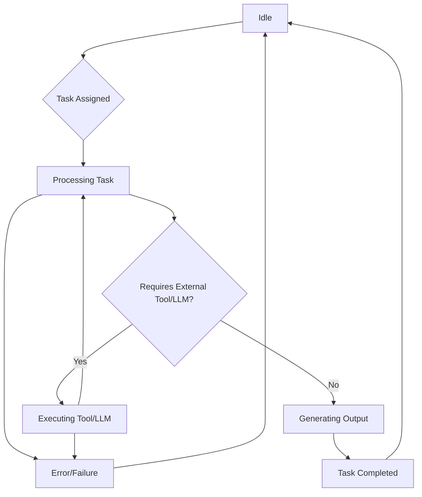

# Personal AI Assistant System Specification

## 1. Product Vision and Goal
To develop an intelligent, multi-agent personal AI assistant capable of proactively managing various aspects of a user's life, including scheduling, learning, financial planning, and health & wellness, through seamless inter-agent communication and collaboration. The primary goal is to enhance user productivity, well-being, and knowledge acquisition.

## 2. Core Features
Based on the selected agents, the system will provide the following core functionalities:
*   **Intelligent Scheduling & Planning:** Manage calendars, appointments, and tasks.
*   **In-depth Information Retrieval:** Conduct comprehensive research on diverse topics.
*   **Personalized Learning & Explanation:** Simplify complex concepts and adapt to learning styles.
*   **Financial Management & Advice:** Track expenses, manage budgets, and provide investment insights.
*   **Health & Wellness Guidance:** Suggest routines, meal plans, and mindfulness practices.

## 3. Agent Roles and Responsibilities

### 3.1. Planner Agent
*   **Role:** Manages the user's schedule, appointments, and tasks.
*   **Responsibilities:**
    *   Integrate tasks and appointments into daily, weekly, and monthly schedules.
    *   Optimize schedules for productivity and well-being.
    *   Receive scheduling requests from other agents (e.g., "schedule a learning session," "block time for a workout").
    *   Communicate schedule conflicts or confirmations.

### 3.2. Deep Research Agent
*   **Role:** Conducts thorough and in-depth research on any given topic.
*   **Responsibilities:**
    *   Receive research queries from other agents or the user.
    *   Gather, synthesize, and structure information from various sources.
    *   Provide comprehensive and relevant insights.
    *   Communicate research findings to requesting agents.

### 3.3. Tutor Agent
*   **Role:** Explains complex concepts in an understandable and engaging manner.
*   **Responsibilities:**
    *   Receive requests to explain concepts, often based on research findings.
    *   Adapt explanations to the user's presumed learning style.
    *   Break down intricate subjects into simpler terms.
    *   Communicate clear and concise explanations.

### 3.4. Financial Advisor Agent
*   **Role:** Provides sound financial advice, manages budgets, tracks expenses, and identifies investment opportunities.
*   **Responsibilities:**
    *   Receive financial queries or data from the user or other agents.
    *   Analyze financial data (e.g., budget, expenses, investment goals).
    *   Provide actionable financial recommendations.
    *   Communicate financial assessments and advice.

### 3.5. Health & Wellness Coach Agent
*   **Role:** Guides the user towards a healthier lifestyle by suggesting personalized fitness routines, meal plans, and mindfulness practices.
*   **Responsibilities:**
    *   Receive health-related goals or data from the user.
    *   Suggest personalized fitness routines, meal plans, and mindfulness practices.
    *   Provide motivational support and track progress.
    *   Communicate health and wellness plans and recommendations.

### 3.6. Memory Agent
*   **Role:** Efficiently stores and retrieves relevant information to provide context and enable long-term learning for the personal assistant system.
*   **Responsibilities:**
    *   Store textual information and associated metadata in a vector database.
    *   Retrieve semantically similar information based on queries.
    *   Provide retrieved memories as context to other agents.
    *   Ensure data persistence and efficient retrieval for long-term knowledge retention.

## 4. Architecture Overview (High-Level)

The Personal AI Assistant system will be built upon the CrewAI framework, leveraging a multi-agent architecture. Each agent operates semi-autonomously with a defined role, goal, and backstory, but critically, they communicate and collaborate to achieve complex user requests.

*   **Central Orchestration (CrewAI):** A main script (`main.py`) will define the overall "Crew" and initiate tasks. It will manage the flow of information and task delegation among agents.
*   **Agent Modules:** Each agent will be defined in `agents.py`, encapsulating its specific capabilities.
*   **Task Modules:** Specific tasks that agents can perform will be defined in `tasks.py`.
*   **Communication Channels:** Agents will communicate by passing the output of one task as context to another task, enabling a sequential and collaborative workflow.

### 4.1. Agent Interaction Diagram

The following diagram illustrates the high-level communication paths and data flow between the different agents in the system.

```mermaid
graph TD
    A[Start Crew] --> B{Next Task Available?}
    B -- Yes --> C[Assign Task to Agent]
    C --> D[Agent Executes Task]
    D --> E{Task Successful?}
    E -- Yes --> B
    E -- No --> F[Handle Task Failure]
    F --> G[End Crew (with Failure)]
    B -- No --> H[All Tasks Completed]
    H --> I[End Crew (Success)]
```

## 5. Communication Flow Examples

### Example 1: Investment Planning
1.  **User Request:** "I want to start investing in AI stocks. Help me understand it, see if I can afford it, and schedule time to learn."
2.  **Deep Research Agent:** Receives a task to research "overview of AI stocks and their potential."
    *   *Output:* Comprehensive research report on AI stocks.
3.  **Memory Agent (Store):** Receives the research report from Deep Research Agent and stores it in the vector database for future reference.
    *   *Input:* Research report from Deep Research Agent.
    *   *Output:* Confirmation of memory storage.
4.  **Tutor Agent:** Receives a task to "explain the basics of stock investment and how to interpret AI stock research."
    *   *Input:* Output from Deep Research Agent.
    *   *Memory Retrieval (Optional):* Queries Memory Agent for past explanations on "stock investment basics" to enrich its context.
    *   *Output:* Simplified explanation of stock investment and AI stock research.
5.  **Memory Agent (Store):** Receives the explanation from Tutor Agent and stores it in the vector database.
    *   *Input:* Explanation from Tutor Agent.
    *   *Output:* Confirmation of memory storage.
6.  **Financial Advisor Agent:** Receives a task to "assess user's current budget for a new investment in AI stocks."
    *   *Input:* Output from Deep Research Agent (for context on AI stocks) and potentially user's financial data (simulated).
    *   *Output:* Financial assessment and advice on affordability.
7.  **Memory Agent (Store):** Receives the financial advice from Financial Advisor Agent and stores it in the vector database.
    *   *Input:* Financial advice from Financial Advisor Agent.
    *   *Output:* Confirmation of memory storage.
8.  **Planner Agent:** Receives a task to "schedule dedicated time for the user to learn about AI stock investment and review financial advice."
    *   *Input:* Output from Tutor Agent (learning content) and Financial Advisor Agent (advice).
    *   *Output:* Proposed schedule for learning and review sessions.
9.  **Memory Agent (Store):** Receives the generated schedule from Planner Agent and stores it in the vector database.
    *   *Input:* Schedule from Planner Agent.
    *   *Output:* Confirmation of memory storage.

### Example 2: Healthy Lifestyle Integration
1.  **User Request:** "I want to start a healthier lifestyle. Can you suggest a plan and help me fit it into my week?"
2.  **Health & Wellness Coach Agent:** Receives a task to "suggest a personalized health and wellness plan."
    *   *Output:* Detailed plan including workout routines, meal suggestions, and mindfulness exercises.
3.  **Planner Agent:** Receives a task to "integrate the health and wellness plan into the user's weekly schedule."
    *   *Input:* Output from Health & Wellness Coach Agent.
    *   *Output:* Updated weekly schedule with health activities.

## 6. Tools and Dependencies
*   **Core Framework:** CrewAI
*   **Python Libraries:** (as specified in `requirements.txt`, e.g., `crewai`, `langchain-openai`, `chromadb`)
*   **LLM Provider:** A Large Language Model (LLM) is required for agents to perform their reasoning and task execution. This project is configured to use a local LLM accessible via an OpenAI-compatible API endpoint (e.g., LM Studio, Ollama).
    *   **Local LLM Endpoint:** `http://192.168.1.14:1234/v1`
    *   **API Key:** `sk-no-key-required` (for local LLMs)
*   **Vector Database (for Memory Agent):** ChromaDB (local persistent client)
    *   **Purpose:** Stores and retrieves vector embeddings of memories for long-term retention and semantic search.
    *   **Storage Location:** `./chroma_db` directory within the project.
*   **Embedding Model:** An embedding model is used by the Memory Agent to convert text into numerical vectors for storage and retrieval in the vector database.
    *   **Current Implementation:** Uses a mock embedding function for demonstration.
    *   **Production Recommendation:** For real-world use, a robust embedding model (e.g., OpenAI's `text-embedding-ada-002`, Sentence Transformers models) should be integrated.
*   **Potential Future Tools (for enhanced functionality):**
    *   Calendar API (for Planner)
    *   Search API (for Deep Research)
    *   Financial Data API (for Financial Advisor)
    *   Health Tracking API (for Health & Wellness Coach)

## 7. Agent Communication Schema

Agents within this system communicate primarily through the structured passing of information via **Task Outputs** and **Task Context**. This ensures a clear, traceable, and asynchronous flow of data and instructions between specialized agents.

*   **Task Outputs:** When an agent completes a task, its output (e.g., a research report, a financial analysis, a generated schedule) becomes available. This output is typically a well-defined string or a structured data format (e.g., JSON) that can be consumed by other agents.
*   **Task Context:** Subsequent tasks can explicitly declare dependencies on the outputs of previous tasks. The CrewAI framework facilitates this by allowing the output of one task to be injected as `context` into the `description` or `expected_output` of a following task. This mechanism enables agents to build upon each other's work.
*   **Implicit Communication (Shared Goals/Roles):** While not direct message passing, agents also implicitly communicate through their shared understanding of the overall crew's goal and their individual roles. This allows them to anticipate needs and contribute relevant information even without explicit requests.
*   **Future Enhancements (Direct Messaging/Shared Memory):** For more complex scenarios, direct agent-to-agent messaging or a shared, persistent memory module could be integrated, allowing for more dynamic and less sequential interactions.

## 8. Conceptual State Diagrams

### 8.1. Agent Lifecycle within a Task

A conceptual state diagram for an individual agent processing a task:



*   **Idle:** Agent is waiting for a task.
*   **Task Assigned:** Agent receives a new task.
*   **Processing Task:** Agent is actively working on the task, reasoning, and planning.
*   **Requires External Tool/LLM?:** Agent determines if it needs to use an external tool (like a search engine) or an LLM call to complete its current step.
*   **Executing Tool/LLM:** Agent interacts with an external tool or makes an LLM call.
*   **Generating Output:** Agent synthesizes information and prepares its final output for the task.
*   **Task Completed:** Agent successfully finishes the task and its output is available.
*   **Error/Failure:** An error occurred during processing or tool execution, leading to task failure.

### 8.2. Crew Execution Flow (High-Level)

A conceptual state diagram for the overall crew's execution:

```mermaid
graph TD
    A[Start Crew] --> B{Next Task Available?}
    B -- Yes --> C[Assign Task to Agent]
    C --> D[Agent Executes Task]
    D --> E{Task Successful?}
    E -- Yes --> B
    E -- No --> F[Handle Task Failure]
    F --> G[End Crew - Failure]
    B -- No --> H[All Tasks Completed]
    H --> I[End Crew (Success)]
```

*   **Start Crew:** The CrewAI system is initialized and begins execution.
*   **Next Task Available?:** The orchestrator checks if there are pending tasks.
*   **Assign Task to Agent:** A task is assigned to the appropriate agent based on its role and dependencies.
*   **Agent Executes Task:** The assigned agent processes the task (as per its own lifecycle).
*   **Task Successful?:** The orchestrator checks the outcome of the agent's task.
*   **Handle Task Failure:** If a task fails, the crew's error handling mechanism is triggered.
*   **End Crew (with Failure):** The crew terminates due to an unrecoverable task failure.
*   **All Tasks Completed:** All defined tasks have been successfully executed.
*   **End Crew (Success):** The crew successfully completes all its objectives.